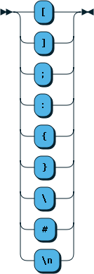
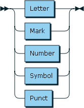
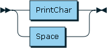
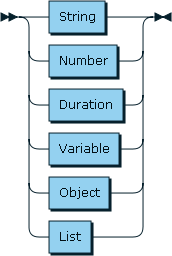
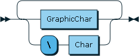

# Moon

Moon is a human-readable data exchange format designed to be used as a
configuration language in software projects. This projects contains a
description of Moon's grammar and a reference implementation of a moon
interpreter written in Go. For some history as to why this project was seen as
worthwhile, please see the [WHY](WHY.md) doc. For a description of Moon's
design goals (and non-goals), please see the [GOALS](GOALS.md) doc.

# Instability

This project is not yet stable. Things may change. It's not recommended that
you use this in any type of production system, since I can't guarantee future
compatibility at this time.

# Design

A Moon file is a human-readable description of an unordered collection of
key-value pairs. Parsing a Moon file always yields either a Moon Document
or an error.

The top level of a Moon document contains a series of key-value pairs separated with a colon:


E.g.:

```
name: Jordan
age: 29
```

# Terminal characters



The following characters are defined as being terminal characters: `[`, `]`,
`{`, `}`, `:`, `;`, `#` and `\n`. Unless escaped or quoted, terminal characters
terminate any value that precedes them.

# Printable characters



A printable character is defined as being any Unicode character in the
categories L (letters), N (numbers), M (marks), S (symbols), and P
(punctuation), with the exception of previously mentioned terminal characters.

# Graphic characters



A Graphic character is defined as being a Printable character or whitespace
character. This includes all of the characters in the unicode category Z, with
the exception of the newline character, which is considered a terminal
character.

# Identifiers


Any run of printable characters may describe an identifier. That is, any
sequence of letters and numbers may describe an identifier. Identifiers may not contain spaces. Identifiers may
contain characters outside of the ASCII range without needing any special
escaping. This includes accented letters, marks, and emoji. The following are
valid identifiers:

```
hello
halló
您好
🐼🔫🎁
```

# Values



A Value may represent a variety of types. Moon defines the following value
types: strings, numbers, durations, variables, objects, and lists.

# Strings

Strings come in two flavors: bare strings and quoted strings.

A bare string is defined as being any run of graphic characters.



Since the newline character is excluded from the graphic characters, a bare string is terminated at the first unescaped newline.

# Types

Moon defines the following types:

- integers: right now this is an int based on Go semantics; it's a 32 bit int
  on 32 bit CPUs, and a 64 bit int on 64 bit CPUs.  These are some integers:

```
1
2
-1
-12348
0
+0
```

- floats: they're all float64.  These are some floats:

```
1.0
1.2
-9.3
3.14
1e9
```

- complex numbers: they're complex128 values in Go.  These are some complex numbers:

```
1+2i
-9+4i
```

- strings: they're strings.  They're not explicitly required to be composed of
  UTF-8 runes but I haven't really been testing binary data, so for the moment,
  all bets are off here.  They're quoted, but maybe I'll go back on that.
  These are strings:

```
this is a bare string
"this is a quoted string"
'this is also a quoted string'

inside of a bare string, "quotes" don't need to be escaped
but semicolons \;, colons \:, parens \( and \), brackets \[ and \] and braces \{ \} need to be escaped.
```

  You can use single or double quotes.  Escape quotes with a backslash.  Quoted
  strings may contain newlines and special characters.

  The following characters are special characters: `:`, `;`, `[`, `]`, `#`,
  `{`, and `}`.  The colon is used to separate a key from a value.  The
  semicolon is used to terminate a bare string.  A newline will also terminate
  a bare string.  A close bracket must be a special string in order to support
  a bare string being the last element of a list, without requiring that you
  add a semicolon after it.  An open bracket doesn't need to be a special
  character, but I made it a special character to be symetrical with the close
  bracket.  The same logic applies for braces.

- objects: or maybe you call them hashes, objects, or associative arrays.  Moon
  calls them objects, but you'd never know it because it's actually the
  `map[string]interface{}` type in Go, which is effectively the same thing.
  Keys are bare strings, but object keys may not contain spaces.

  These are some objects:

```
# key-value pairs are delimited by spaces; no commas are required
{name: "jordan" age: 28}

{
    one: 1
    two: two is also a number
    pi: 3.14
}

# you may use a bare string as a value, but a semicolon is required to
# terminate the bare string
{name: jordan; age: 28}
```

- lists: they're `[]interface{}` values.  They're not typed, and they can be
  heterogenous.  Values are separated by spaces.  I might put commas back in,
  that's kinda up in the air right now.  These are some lists:

```
[1 2 3]
[
  one
  2
  3.14
]

# this is a list of three elements
[moe; larry; curly]

# this is a list of one element
[moe larry curl]
```

- variables: a variable is indicated with a `@` character.  A variable may
  refer to any key that has already been defined in the current moon document.
  Here is an example of how you would use a variable:

```
original_value: this is the original value, which is a string
duplicate_value: @original_value
```

  If the name of a key begins with an `@` character, it is a private key.  A
  private key may be referenced in the rest of the moon document, but it is not
  available anywhere outside of the moon document parser.  This is useful for
  the composition of larger, nested values, without polluting the document's
  root namespace.  Here is an example of a private key:

```
@my_private_key: a great value
my_public_key: @my_private_key
```

  This isn't particularly useful for simple values, but consider the following:

```
@prod: {
    label: production
    hostname: prod.example.com
    port: 9000
    user: prod-user
}

@dev: {
    label: development
    hostname: dev.example.com
    port: 9200
    user: dev-user
}

servers: [@prod @dev]
```

  The only key in the root namespace of the document is `servers`; the
  individual server configs are considered only a part of the document.  Since
  we know that these values are private to the document itself, we know we are
  free to modify them as we see fit, without affecting how the host program
  sees the moon document.
