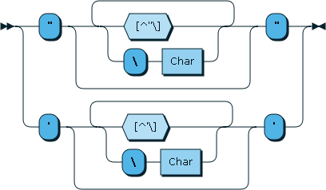
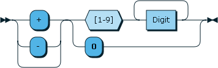
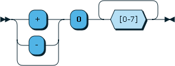
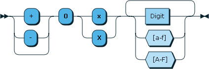
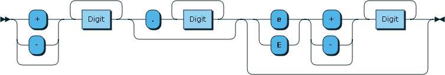
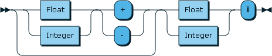
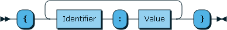

# Moon

Moon is a human-readable data exchange format designed to be used as a
configuration language in software projects. This projects contains a
description of Moon's grammar and a reference implementation of a moon
interpreter written in Go. For some history as to why this project was seen as
worthwhile, please see the [WHY](WHY.md) doc. For a description of Moon's
design goals (and non-goals), please see the [GOALS](GOALS.md) doc.

# Instability

This project is not yet stable. Things may change. It's not recommended that
you use this in any type of production system, since I can't guarantee future
compatibility at this time.

# Example

```
# strings don't require quotes
first_name: jordan
last_name: orelli

# but you may quote them if you wish
city: "Brooklyn"

# this is an integer
age: 29

# this is a float
pi: 3.14

# lists defined ordered collections and are contained in square brackets. There is no separator character.
numbers: [1 2 3]
quoted_strings: ["one" "two" "three"]
bare_strings: [one; two; three]
nested_list: [
  [0 0]
  [0 3]
  [5 0]
]

# objects described unordered collections and are contained in curly braces.
object: {key: value; other_key: other_value}

other_object: {
    key_1: one
    key_2: 2
    key_3: 3.4
    key_4: [five; 6 7.8]
}

# bare strings that can be parsed as durations are parsed as durations.

# thirty seconds
dur_one: 30s

# 5 hours, 3 minutes, 27 seconds and 9 milliseconds
dur_two: 5h3m27s9ms

# we may reference an item that was defined earlier using a sigil
repeat_object: @object

# items can be hidden.  i.e., they are only valid in the parse and eval stage
# as intermediate values internal to the config file; they are *not* visible to
# the host program.  This is generally useful for composing larger, more
# complicated things.
@hidden_item: it has a value
visible_item: @hidden_item

@person_one: {
    name: the first name here
    age: 28
    hometown: crooklyn
}

@person_two: {
    name: the second name here
    age: 30
    hometown: tha bronx
}

people: [@person_one @person_two]

# if you need to embed a large block of text, bash-style HERE documents are
# supported.

startup: <<EOF
This is a here document.  The << operator indicates that a label for a heredoc
is incoming.  <<EOF thus begins a heredoc with the label EOF.  A heredoc may be
closed by indicating the label name on a line all by itself.

http://en.wikipedia.org/wiki/Here_document

A heredoc may contain any characters at all and they require no escaping.
# This line that looks a bit like a comment is not a comment; it will be
# included in the output.
{ <-- that didn't start an object
and this won't end one --> }
because there are no types inside of here documents; the whole thing is just
one big string.
This is the last line of the here doc. The next line is the terminator.
EOF
# This comment is outside of the heredoc.
```

# Design

A Moon file is a human-readable description of an unordered collection of
key-value pairs. Parsing a Moon file always yields either a Moon Document
or an error.

The top level of a Moon document contains a series of key-value pairs separated with a colon:


E.g.:

```
name: Jordan
age: 29
```

# Terminal characters


The following characters are defined as being terminal characters: `[`, `]`,
`{`, `}`, `:`, `;`, `#` and `\n`. Unless escaped or quoted, terminal characters
terminate any value that precedes them.

# Printable characters


A printable character is defined as being any Unicode character in the
categories L (letters), N (numbers), M (marks), S (symbols), and P
(punctuation), with the exception of previously mentioned terminal characters.

# Graphic characters


A Graphic character is defined as being a Printable character or whitespace
character. This includes all of the characters in the unicode category Z, with
the exception of the newline character, which is considered a terminal
character.

# Identifiers


Any run of printable characters may describe an identifier. That is, any
sequence of letters and numbers may describe an identifier. Identifiers may not contain spaces. Identifiers may
contain characters outside of the ASCII range without needing any special
escaping. This includes accented letters, marks, and emoji. The following are
valid identifiers:

```
hello
halló
您好
🐼🔫🎁
```

# Values


A Value may represent a variety of types. Moon defines the following value
types: strings, numbers, durations, variables, objects, and lists.

# Strings

Strings come in two flavors: bare strings and quoted strings.

##### Bare Strings

A bare string is defined as being any run of graphic characters.


Since the newline character is excluded from the graphic characters, a bare string is terminated at the first unescaped newline. Any unescaped terminal character (such as the semicolon) will terminate a bare string. Bare strings are so named because they are *not* wrapped in quotes. These are bare strings:
```
it was the best of times, it was the worst of times
I'm a bare string with a quote in me!
But I have to escape \[ these brackets \]
```
The following is a sequence of three bare strings:
```
one; two; three
```

##### Quoted Strings

A string may be enclosed in quotes. Either single quotes or double quotes may be used.



Using a single quote inside of a single-quoted string or a double-quote inside of a double-quoted string requires escaping the enclosed quote with a backslash. Quoted strings may contain newlines. These are quoted strings:
```
"I am a great quoted string"
'so am I!'
"I have some \"escped\" quotes inside of me"

```

# Integers

Integers are any whole number that can fit into a 32 or 64 bit integer value (depending on architecture). On 32 bit machines, an Integer is defined as int32, and on 64 bit machines, an Integer is defined as int64.  Integers may be represented using either decimal, octal, or hexadecimal notation.

##### Decimal Integers

Decimal integers are represented by a run of digit characters, optionally preceded by a sign.



##### Octal Integers

Octal integers are written with a preceding `0` character, followed by 1 or more characters in the range `[0-7]`.



##### Hexadecimal Integers

Hex integers are written with a preceding `0x` or `0X`, followed by one or more hex characters.



# Floats

Floating point numbers are represented using one or more decimal points.



Additionally, any number written in [E Notation](http://en.wikipedia.org/wiki/Scientific_notation#E_notation) is treated as a float.

# Complex numbers

I'm pretty sure this diagram is wrong.



# Lists


# Objects



# Variables


